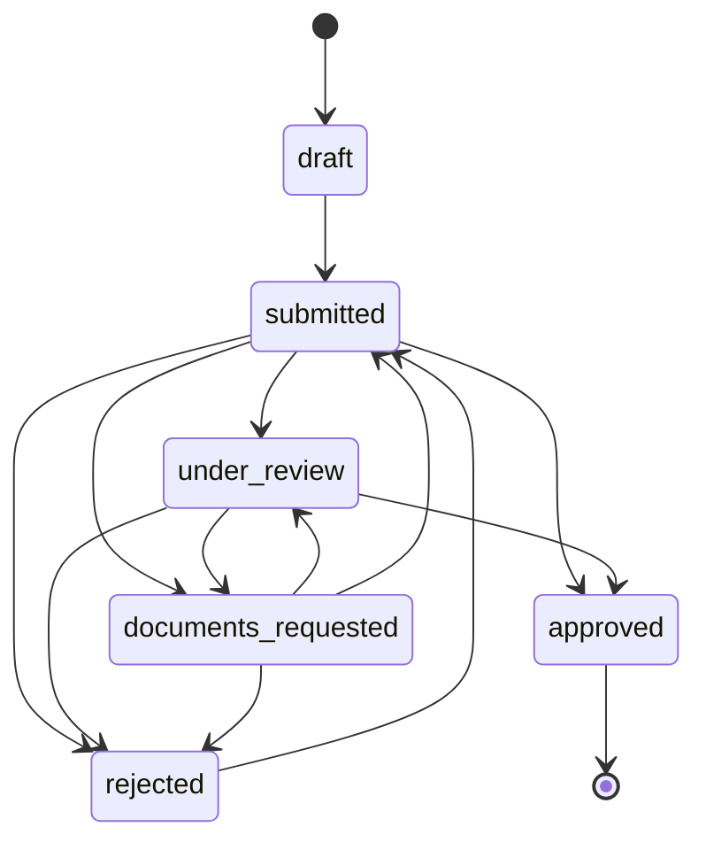

# API reference

Base URL `http://localhost:8010`. Interactive schema at `/docs`.

## Conventions

- **Language.** Almost every endpoint takes `?lang=en|hi|ta`. The backend
  returns already-translated text, so a client never holds a second copy of the
  wording. Unknown codes silently fall back to `en`.
- **Dates** are ISO `YYYY-MM-DD`. Timestamps are ISO-8601 UTC.
- **Money** is a plain number of rupees; endpoints that display it also return a
  preformatted `*_text` field using Indian lakh and crore units.
- **Confidence** is a float from 0 to 1. Manual entries carry `1.01`, above any
  OCR result, which is how manual values win the merge.
- **Errors** are FastAPI shape: `{"detail": "message"}` with the status code.

| Status | Meaning |
|---|---|
| 400 | Empty upload |
| 404 | Unknown profile, document, scheme, application or reminder |
| 409 | Illegal application status transition |
| 413 | Upload above `MAX_UPLOAD_BYTES` |
| 415 | Upload is not an image or PDF |
| 422 | Request body failed validation |

## Meta

### `GET /api/health`

Liveness plus which OCR providers actually resolved on this machine. Worth
calling before a demo.

```json
{
  "status": "ok",
  "ocr_providers": { "rapidocr-onnx": true, "pdf-text": true, "tesseract": false },
  "schemes": 16,
  "catalog": { "last_reviewed": "2026-08-21", "currency": "INR", "note": "..." }
}
```

### `GET /api/meta/languages`

Every configured language with the share of the English key set it actually
covers. `complete: false` means the UI should mark it as partial rather than
pretending it is finished.

```json
[
  { "code": "en", "label": "English", "native": "English", "tts": "en-IN", "coverage": 1.0, "complete": true },
  { "code": "hi", "label": "Hindi",   "native": "हिन्दी",  "tts": "hi-IN", "coverage": 1.0, "complete": true },
  { "code": "ta", "label": "Tamil",   "native": "தமிழ்",  "tts": "ta-IN", "coverage": 0.83, "complete": false }
]
```

`tts` is the BCP-47 tag the frontend hands to the browser speech synthesiser.

### `GET /api/meta/strings?lang=hi`

The full string bundle for a language, English-backfilled. Flat
`{ key: string }` with `{placeholder}` interpolation. This is the only source of
UI wording.

### `GET /api/meta/doc-types?lang=hi`

The twelve document types the extractor understands, with translated labels.
Used to populate the manual override when detection is unsure.

### `GET /api/meta/fields?lang=hi`

The editable profile field catalogue. The profile screen renders entirely from
this, so adding a field never requires a frontend change.

```json
[
  { "name": "annual_income", "type": "number", "group": "household",
    "unit": "INR", "label": "Yearly family income" },
  { "name": "ration_card_type", "type": "choice", "group": "household",
    "options": ["AAY", "PHH", "BPL", "APL"],
    "label": "Ration card type",
    "option_labels": { "AAY": "Antyodaya (AAY)", "PHH": "Priority household (PHH)" } }
]
```

`type` is one of `text`, `date`, `number`, `tel`, `choice`, `boolean`.

## Profile

### `POST /api/profiles`

Creates a profile. There is no authentication; the returned id is the session.

Request `{ "language": "hi" }`

### `GET /api/profiles/{id}?lang=hi`

```json
{
  "id": 2,
  "language": "hi",
  "fields": { "full_name": "Sunita Devi", "date_of_birth": "1968-04-12", "annual_income": 84000.0 },
  "derived": { "age": 58, "is_bpl": true },
  "aadhaar_last4": "0124",
  "account_last4": "8963",
  "field_sources": {
    "full_name": {
      "value": "Sunita Devi", "method": "ocr", "confidence": 0.8,
      "doc_type": "aadhaar", "source_document_id": 1, "at": "2026-08-21T13:38:18Z"
    }
  },
  "filled_count": 14, "total_count": 28, "completeness": 50.0
}
```

`derived` holds values computed rather than stored: `age` from date of birth and
`is_bpl` from the ration card category. `field_sources` is the provenance record
that lets the UI say where a value came from.

### `PATCH /api/profiles/{id}?lang=hi`

Partial update. Any subset of the writable fields. Every field set here is
recorded with `method: "manual"` and confidence `1.01`, so later OCR never
overwrites it.

Request `{ "marital_status": "widowed", "is_govt_employee": false }`

Returns the same shape as `GET`.

### `GET /api/profiles/{id}/questions?lang=en`

The self-declared answers that would settle the most undecided schemes, ranked
by payoff. These are the questions no document can answer. Ask two of these
rather than twenty generic ones.

```json
[
  { "name": "is_govt_employee", "type": "boolean", "group": "declarations",
    "label": "Is anyone in your family a government employee?",
    "unlocks": 4, "scheme_ids": ["nfsa_ration", "pm_kisan", "pmay_g", "pmmvy"] }
]
```

## Documents

### `POST /api/profiles/{id}/documents?lang=en`

The main pipeline. `multipart/form-data` with `file`, and an optional `doc_type`
to override detection.

One call performs: store the original, run OCR, detect the document type,
extract fields, redact identity numbers, persist, merge into the profile by
confidence, refresh reminders, and re-evaluate all sixteen schemes.

```json
{
  "document": {
    "id": 1, "doc_type": "aadhaar", "label": "Aadhaar card",
    "doc_type_confidence": 1.0, "ocr_engine": "rapidocr-onnx", "ocr_confidence": 0.9833,
    "number_masked": "XXXX XXXX 0124",
    "issue_date": null, "expiry_date": null,
    "state": "no_expiry", "days_left": null,
    "warnings": [],
    "extracted_fields": {
      "date_of_birth": { "value": "1968-04-12", "confidence": 0.92, "raw": "12/04/1968", "note": null }
    }
  },
  "changes": [
    { "field": "full_name", "label": "Full name", "value": "Sunita Devi",
      "confidence": 0.8, "replaced": false }
  ],
  "ocr": { "engine": "rapidocr-onnx", "confidence": 0.9833, "line_count": 9, "warnings": [] },
  "profile": { "...": "the full profile object" },
  "eligible_count": 0,
  "need_info_count": 13,
  "next_documents": [
    { "doc_type": "bank_passbook", "label": "Bank passbook", "unlocks": 5,
      "scheme_ids": ["apy", "jan_dhan", "pm_kisan", "pmjjby", "pmsby"] }
  ]
}
```

`changes` is what actually moved, which is what the upload screen shows. A field
that lost the confidence contest does not appear. `next_documents` drives the
prompt that makes the product work.

Warning codes you may see:

| Code | Meaning |
|---|---|
| `no_text_detected` | The image produced no text at all |
| `pdf_has_no_text_layer` | Scanned PDF with no embedded text |
| `ocr_unavailable_enter_manually` | No provider could handle the file |
| `unrecognised_document_type` | Detection scored nothing; pass `doc_type` to override |
| `no_fields_extracted` | Type was recognised but nothing usable came out |
| `aadhaar_checksum_failed` | Twelve digits found but the Verhoeff digit is wrong |

### `GET /api/profiles/{id}/documents?lang=hi`

Array of the document objects shown above, newest first.

### `GET /api/documents/{id}/file`

The stored original, with its own content type. Used by the vault to let someone
look at the paper they uploaded.

### `DELETE /api/documents/{id}`

Removes the row and the file from disk. Values already merged into the profile
remain; delete removes the document, not the person data taken from it.

## Schemes

### `GET /api/profiles/{id}/schemes?lang=hi`

Every scheme, evaluated and explained, ranked by usefulness. Optional
`&status=eligible|need_more_info|not_eligible` filters the list. Note that
`summary` is always computed across all schemes, before the filter.

```json
{
  "schemes": [ "...array of explanation objects, see below..." ],
  "summary": {
    "eligible": 4, "need_more_info": 8, "not_eligible": 4,
    "annual_value": 3600, "annual_value_text": "Rs 3,600",
    "cover_value": 500000, "cover_value_text": "Rs 5 lakh"
  },
  "next_documents": [ { "doc_type": "job_card", "label": "MGNREGA job card", "unlocks": 2 } ],
  "disclaimer": "यह ऐप योजनाओं को समझने में मदद करता है..."
}
```

`annual_value` counts only recurring cash. `cover_value` is the largest health
or insurance cover, reported separately. They are never added, because summing a
five lakh hospital cover into a yearly income figure would tell a widow on a
three hundred rupee pension that she is owed lakhs.

### `GET /api/profiles/{id}/schemes/{scheme_id}?lang=hi`

One scheme, fully explained. This is the payload the detail page renders.

```json
{
  "scheme_id": "ignwps",
  "name": "विधवा पेंशन (IGNWPS)",
  "full_name": "इंदिरा गांधी राष्ट्रीय विधवा पेंशन योजना",
  "department": "ग्रामीण विकास मंत्रालय (एनएसएपी)",
  "category": "pension",
  "status": "need_more_info",
  "status_label": "एक जानकारी बाकी है",
  "confidence": 0.75,
  "headings": { "what_you_get": "आपको क्या मिलेगा", "why_you_qualify": "आप पात्र क्यों हैं" },
  "what_you_get": "80 वर्ष की आयु तक 300 रुपये मासिक...",
  "benefit_amount": 300, "benefit_amount_text": "Rs 300", "benefit_period": "month",
  "why_you_qualify": [ { "text": "आप महिला हैं", "field": "gender" } ],
  "why_not": [],
  "still_needed": [
    { "text": "आप विधवा हैं", "field": "marital_status",
      "field_label": "वैवाहिक स्थिति", "document_hints": [] }
  ],
  "assumptions": [ { "text": "आप आयकर नहीं भरते", "field": "is_income_tax_payer" } ],
  "what_to_do": [ "हमें एक बात बताएँ: वैवाहिक स्थिति" ],
  "documents_needed": [ { "doc_type": "aadhaar", "label": "आधार कार्ड", "have": true } ],
  "where_to_go": "ग्राम पंचायत या खंड विकास कार्यालय...",
  "apply_url": "https://nsap.nic.in",
  "processing_time": "फैसले में आमतौर पर लगभग 45 दिन लगते हैं।",
  "speech_text": "...the whole page as one flat string for text to speech...",
  "application": null,
  "form_preview": {
    "form_id": "nsap_form", "title": "National Social Assistance Programme pension application",
    "completion_percent": 86.7,
    "missing_required": [ { "field": "mobile", "label": "Mobile number" } ],
    "field_count": 19
  }
}
```

Field notes:

- `confidence` is the share of rules decided on real data, not a probability of
  approval.
- `still_needed[].document_hints` is empty when the gap is a question rather than
  a paper; the UI then links to the profile screen instead of the upload screen.
- `assumptions` are exclusions that could not be checked. The result is still
  eligible, but the page must say what was assumed.
- `speech_text` stitches the sections into sentences, because bullet fragments
  run together when read aloud.

## Applications

### `POST /api/profiles/{id}/applications?lang=en`

Request `{ "scheme_id": "igndps" }`

Creates a draft, autofills the form from the profile, and renders the PDF.
Calling it again for the same scheme refreshes the fill against current profile
data rather than creating a duplicate.

```json
{
  "id": 1,
  "scheme_id": "igndps",
  "scheme_name": "Disability Pension (IGNDPS)",
  "status": "draft",
  "status_label": "Not sent yet",
  "reference_no": null,
  "completion_percent": 86.7,
  "missing_fields": [
    { "field": "mobile", "label": "Mobile number" },
    { "field": "village_town", "label": "Village or town" }
  ],
  "has_form": true,
  "days_waiting": null,
  "events": [
    { "status": "draft", "status_label": "Not sent yet", "note": "Form prepared",
      "actor": "system", "at": "2026-08-21T13:38:18Z" }
  ]
}
```

If PDF rendering fails the application is still created with `has_form: false`.
A drawing error must not lose the record.

### `GET /api/profiles/{id}/applications?lang=hi`

All applications, most recently updated first.

### `POST /api/applications/{id}/status?lang=en`

Request `{ "status": "submitted", "note": "Handed in at the Block office" }`

Advances the application and appends a timeline event. Submitting for the first
time issues a reference number such as `HAQ-2026-59924`.

Legal transitions, enforced server side. An illegal move returns 409 rather than
corrupting the timeline:



Status is self-reported. No government portal exposes an API for this, so the
tracker records what the person tells it and prompts a follow-up after thirty
days in `submitted` or `under_review`.

### `GET /api/applications/{id}/form`

The generated PDF, `application/pdf`. Filled values are printed, missing
required fields appear as labelled ruled blanks, and the page is stamped as a
draft requiring verification. 404 if no form was generated.

## Vault

### `GET /api/profiles/{id}/vault?lang=hi`

Documents with their expiry state, plus any reminders now due. Calling this
refreshes reminders as a side effect, so the vault is always current.

```json
{
  "documents": [
    { "id": 3, "doc_type": "income_certificate", "label": "आय प्रमाण पत्र",
      "expiry_date": "2026-10-05", "state": "expiring_soon", "days_left": 45,
      "number_masked": null, "ocr_confidence": 0.9788 }
  ],
  "reminders": [
    { "id": 1, "kind": "expiry",
      "text": "आपका आय प्रमाण पत्र 05/10/2026 को समाप्त हो रहा है। उससे पहले नया बनवा लें।",
      "due_date": "2026-08-06", "document_id": 3, "application_id": null }
  ],
  "counts": { "total": 5, "expiring_soon": 1, "expired": 0 }
}
```

Document `state` is one of `valid`, `expiring_soon` (within sixty days),
`expired`, or `no_expiry`. Reminders are stored as i18n keys plus arguments and
rendered at read time, so switching language switches the reminders too.

### `POST /api/reminders/{id}/done`

Marks a reminder complete so it stops appearing.

## Client

`frontend/lib/api.ts` is a typed wrapper over all of the above, with interfaces
mirroring every response shape. It also owns the session helpers
`ensureProfile`, `getStoredLang` and `setStoredLang`. Import `api` from there
rather than calling `fetch` directly, so that response types stay checked.
