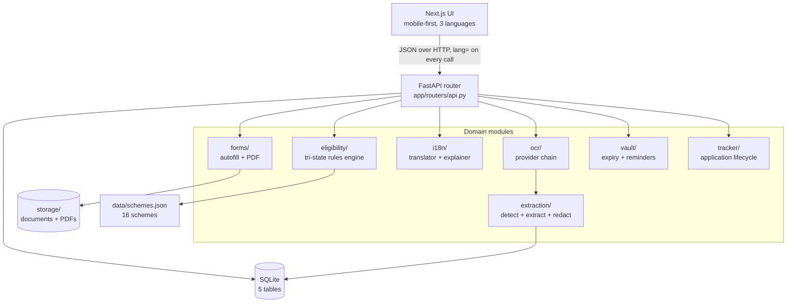
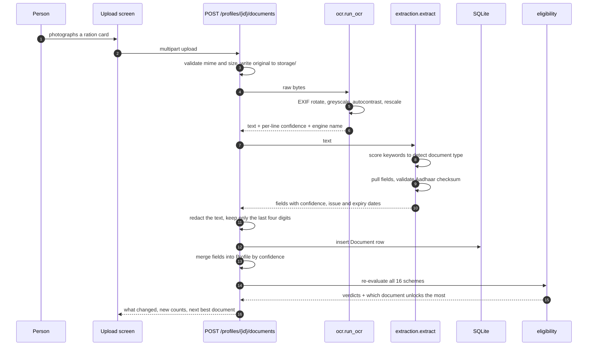
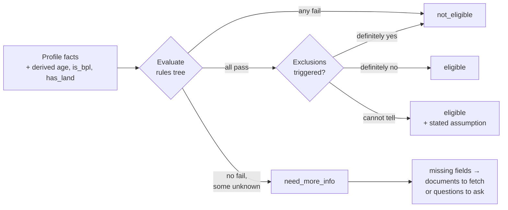

# Architecture

## The problem shapes the system

Two facts about the people this serves drive every structural decision.

**They do not know their own eligibility data.** Nobody knows their social
category code or their annual income to the rupee. They do have a ration card in
a plastic sleeve. So the document is the primary input and the form is the
output, not the other way round.

**Missing data is the normal case, not an error.** A first-time user has one
photograph. A benefits engine that treats absent data as disqualifying will tell
that person they qualify for nothing, and they will close the app. So the rules
engine is tri-state and absence is a prompt rather than a rejection.

Everything below follows from those two.

## Layers



The domain modules do not import each other except in one direction:
`extraction` consumes `ocr` output, `i18n.explain` consumes an
`eligibility.SchemeVerdict`, and `tracker` calls `forms`. Nothing in the domain
imports the router. That keeps every module testable without HTTP.

## The upload path

This is the request worth understanding in full, because six of the seven
modules take part.



Two details in that flow matter more than they look.

**Redaction happens between extraction and persistence.** Extraction needs the
real twelve digits to verify the Verhoeff check digit and derive the last four.
The moment that is done, the text is scrubbed and only the redacted form is
written. There is no window in which a full Aadhaar number sits in the database.

**The merge is confidence-ordered, not arrival-ordered.** See below.

## Conflict resolution

An Aadhaar card and a ration card both claim to know the name. They disagree,
because OCR quality differs. Last-write-wins would mean the answer depends on
upload order, which is indefensible when the output is a government form.

`_merge_into_profile` in `app/routers/api.py` applies three rules:

1. A value typed by the person is never overwritten by OCR. Manual entries carry
   a confidence of `1.01`, above anything an engine can produce.
2. An OCR value only overwrites an existing value if it is strictly more
   confident.
3. Every write records provenance: which document, which engine, what
   confidence, and when.

Provenance is what lets the profile screen say *from your ration card* next to a
value, so a bad read is visible and correctable rather than silently baked into
a PDF.

## Tri-state eligibility

The core of the system. A rule evaluates to `pass`, `fail`, or `unknown`, and a
scheme resolves to `eligible`, `not_eligible`, or `need_more_info`.



`need_more_info` is not a soft rejection. It carries the exact list of missing
fields, and each field maps to either a document that would supply it or a
question to ask. Aggregated across all sixteen schemes, that produces the single
most useful prompt in the product: **add your bank passbook, it settles five
more schemes**.

An exclusion that cannot be checked does not block the result, because most
people this serves plainly do not pay income tax. But the page states the
assumption rather than pretending the check was made.

Details and the rule syntax are in [ELIGIBILITY.md](ELIGIBILITY.md).

## Explanation as a first-class output

The API does not return a scheme and let the client write prose about it. It
returns a finished explanation: headings, reasons, assumptions, numbered steps,
which papers to carry, and a flat string ready for the browser speech
synthesiser.

That placement is deliberate. The reasons are derived from rule outcomes, so
they cannot drift out of sync with the decision. A frontend that composed its
own wording would eventually say *you qualify because you are over sixty* about
a rule that actually tested something else.

Sentences are assembled from short reusable phrases keyed by rule, not written
per scheme:

```json
{ "field": "age", "op": ">=", "value": 60, "key": "rule.age_min", "args": { "n": 60 } }
```

`rule.age_min` resolves to *You are {n} years or older* in English and the
equivalent in Hindi and Tamil. Twenty such phrases, seventeen rules and three
exclusions, cover all sixteen schemes. Adding a language means translating a
flat bundle of about two hundred short strings rather than writing sixteen
scheme essays per language. See [I18N.md](I18N.md).

## Storage

SQLite on disk, five tables, no migrations framework. `init_db()` creates the
schema at startup. For a prototype whose deployment target is one machine, an
ORM plus `create_all` is the right amount of machinery; a real deployment would
add Alembic and move to Postgres.

Uploaded originals and generated PDFs live on the filesystem under `storage/`,
referenced by path from the database. Full schema in
[DATA-MODEL.md](DATA-MODEL.md).

## Why everything runs locally

No cloud OCR, no API keys, no outbound network calls. This is a constraint, not
a shortcut:

- The inputs are identity documents. Sending them to a third-party OCR service
  would be the single worst decision available.
- The deployment target is a Common Service Centre desktop or a shared kiosk
  with unreliable connectivity.
- It makes the demo reproducible with no account setup.

The cost is accuracy: a hosted document AI would read a worn card better than a
local ONNX model. That trade is revisited in the limitations section of the root
[README](../README.md).

## Frontend structure

Next.js App Router, seven pages, mobile-first. Three things worth knowing:

**All strings come from the backend.** `lib/store.tsx` fetches
`/api/meta/strings?lang=` once per language change and exposes `t(key, args)`.
There is no locale bundle in the frontend.

**The session is a profile id in localStorage.** No login stands between a
person and their documents. `ensureProfile()` creates one on first visit and
recovers by creating a fresh profile if the stored id has gone.

**Accessibility is load-bearing, not decoration.** Base font is 17px, touch
targets are at least 56px, contrast is high, and every explanation page has a
read-aloud button wired to the browser speech engine in the active language.
Those are the difference between usable and unusable for the target audience.

## Extension points

| You want to | Change |
|---|---|
| Add a scheme | Append to `backend/data/schemes.json`. Validated at startup. |
| Add a rule field | `models.Profile`, `schemas.FIELD_SPECS`, `eligibility.FIELD_SOURCES` |
| Add a document type | `DOC_SIGNATURES` and `_EXTRACTORS` in `extraction/documents.py` |
| Add a language | A JSON file in `i18n/strings/` plus a row in `config.LANGUAGES` |
| Swap the OCR engine | Add a provider class to `ocr/engine.py` and put it in `PROVIDERS` |
| Add a form | An entry in `FORMS` in `forms/autofill.py` |

None of these require touching the frontend, because the UI renders from
`/api/meta/fields`, `/api/meta/doc-types` and `/api/meta/strings`.

## Known architectural gaps

- **No authentication or encryption at rest.** Acceptable for a prototype,
  disqualifying for production with this data class.
- **Eligibility is central-scheme only.** State variations and SECC deprivation
  codes are not modelled. The catalogue carries a note saying so, and the UI
  shows a disclaimer on every screen.
- **Application status is self-reported.** No government portal exposes an API,
  so the tracker records what the person tells it and prompts a follow-up after
  thirty days.
- **The rules engine has no versioning.** Changing `schemes.json` changes past
  verdicts. A production system would snapshot the rule version against each
  application.
