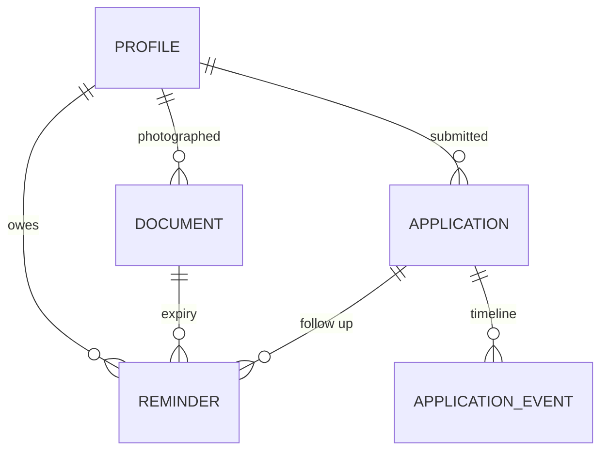

# Data model

SQLite via SQLAlchemy. Five tables, created by `init_db()` at startup. Defined
in `backend/app/models.py`.

There is no migration tool. If you change a column, delete `backend/fed.db` and
let it be recreated. That is acceptable for a prototype and must change before
any deployment.



All child rows cascade on profile delete.

## profiles

One row per person. Deliberately wide and flat: every column is something at
least one scheme tests for, so the rules engine can read facts without joins.

| Group | Columns |
|---|---|
| Session | `id`, `language`, `created_at`, `updated_at` |
| Identity | `full_name`, `date_of_birth`, `gender`, `guardian_name`, `mobile`, `aadhaar_last4`, `pan`, `voter_id` |
| Address | `address_line`, `village_town`, `district`, `state`, `pincode`, `area_type` |
| Socio-economic | `annual_income`, `social_category`, `ration_card_type`, `occupation`, `land_holding_acres`, `family_size`, `marital_status`, `education_level`, `disability_percent`, `is_income_tax_payer`, `is_govt_employee`, `house_type`, `has_lpg_connection`, `is_pregnant_or_lactating` |
| Banking | `has_bank_account`, `bank_name`, `ifsc`, `account_last4` |
| Provenance | `field_sources` (JSON) |

Notes:

- `aadhaar_last4` and `account_last4` hold four characters. The full numbers are
  never stored anywhere. See [OCR.md](OCR.md).
- Every value is nullable. Absence is the normal state and is what produces
  `need_more_info` rather than a rejection.
- `age` and `is_bpl` are **not** columns. They are derived at evaluation time so
  that a stored age cannot go stale.
- Accepted values: `gender` is `male`, `female`, `other`; `area_type` is `rural`
  or `urban`; `social_category` is `GEN`, `OBC`, `SC`, `ST`, `EWS`;
  `ration_card_type` is `AAY`, `PHH`, `BPL`, `APL`; `house_type` is `kutcha`,
  `pucca`, `none`.

### field_sources

The provenance record. One entry per field that has ever been set:

```json
{
  "annual_income": {
    "value": 84000.0,
    "method": "ocr",
    "confidence": 0.85,
    "doc_type": "income_certificate",
    "source_document_id": 3,
    "at": "2026-08-21T13:38:18.755650+00:00"
  }
}
```

This drives two behaviours. The profile screen shows *from your income
certificate* next to the value, so a bad read is visible. And the merge uses
`confidence` to decide whether a new reading wins. Manual entries are written
with `method: "manual"` and confidence `1.01`, above any OCR result, so a person
who corrects a value is never overruled by a later photograph.

## documents

One row per uploaded file.

| Column | Purpose |
|---|---|
| `doc_type`, `doc_type_confidence`, `label` | Detection result and its translated name |
| `original_filename`, `stored_path`, `mime_type`, `size_bytes` | The file on disk under `storage/documents/{profile_id}/` |
| `ocr_engine`, `ocr_text`, `ocr_confidence` | Which provider read it and what it saw. **`ocr_text` is already redacted** and truncated to 20000 characters |
| `extracted_fields` (JSON) | `{ field: { value, confidence, raw, note } }` |
| `warnings` (JSON) | Codes such as `aadhaar_checksum_failed` |
| `issue_date`, `expiry_date` | Expiry derived from issue date plus the validity period for the type |
| `number_masked` | Display form, for example `XXXX XXXX 0124` |

Deleting a document removes the row and the file. Values already merged into the
profile stay, because the person data is not owned by the document.

## applications

One row per person per scheme. Re-applying refreshes the fill rather than
creating a duplicate.

| Column | Purpose |
|---|---|
| `scheme_id`, `scheme_name` | Name is denormalised so history survives a catalogue edit |
| `status` | `draft`, `submitted`, `under_review`, `documents_requested`, `approved`, `rejected` |
| `reference_no` | Issued on first submit, for example `HAQ-2026-59924` |
| `form_pdf_path` | The rendered PDF under `storage/forms/` |
| `filled_fields` (JSON) | What went onto the form |
| `missing_fields` (JSON) | Required fields still blank |
| `completion_percent` | Share of required fields filled |

## application_events

Append-only timeline. `status`, `note`, `actor`, `at`. Status changes go through
`tracker.advance`, which rejects illegal transitions with HTTP 409, so the
timeline is an audit trail rather than a mutable field.

## reminders

| Column | Purpose |
|---|---|
| `kind` | `expiry` or `follow_up` |
| `title_key`, `title_args` (JSON) | An i18n key plus arguments, **not** a finished sentence |
| `due_date`, `done` | |
| `document_id`, `application_id` | Whichever the reminder is about |

Storing the key rather than the text is what lets reminders switch language when
the person does. Rendering happens at read time in `read_vault`, which also
formats the ISO date day-first.

`sync_reminders` is idempotent and runs on upload, on vault read, and on status
change. It creates an expiry reminder when a document is within sixty days of
lapsing, and a follow-up when an application has sat in `submitted` or
`under_review` for thirty days.

## The editable field catalogue

`FIELD_SPECS` in `backend/app/schemas.py` is the single source of truth for how
a profile field is edited. Twenty eight entries across six groups: `identity`,
`address`, `household`, `work`, `bank`, `declarations`.

```python
{ "name": "ration_card_type", "type": "choice", "group": "household",
  "options": ["AAY", "PHH", "BPL", "APL"] }
```

`type` is `text`, `date`, `number`, `tel`, `choice`, or `boolean`. The frontend
renders the profile screen entirely from `/api/meta/fields`, which serves this
list with translated labels and option labels. Adding a field is therefore a
backend-only change.

`TRACKED_FIELDS` is derived from the same list and is the denominator for the
profile completeness percentage.

## Files on disk

```
backend/
  fed.db                          SQLite
  storage/
    documents/{profile_id}/       uploaded originals, uuid filenames
    forms/                        {form_id}_{profile_id}_{timestamp}.pdf
```

Neither directory is encrypted. Both hold personal data. This is the single
largest gap between the prototype and something deployable.
