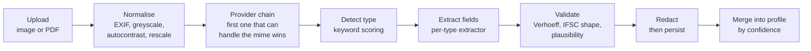

# OCR and extraction

Code: `backend/app/ocr/engine.py` and `backend/app/extraction/`.

The input is a phone photograph of a worn government document held at an angle
in bad light, not a flatbed scan. Every design choice here follows from that.

## Pipeline



## Image normalisation

`_prepare_image` runs before any recognition:

| Step | Why |
|---|---|
| `ImageOps.exif_transpose` | Phone photographs carry a rotation flag rather than rotated pixels |
| Convert to greyscale | Colour adds nothing for printed text and slows the model |
| `ImageOps.autocontrast` | Faded thermal print and uneven lighting |
| Rescale to 1000-2600px on the long edge | Below that the detector misses small print; above it costs time for no gain |

## Provider chain

Providers are tried in order; the first that claims the mime type and returns
text wins. Failure is never fatal: if none succeed the result still comes back
with a warning so the caller can fall back to manual entry.

| Provider | Handles | Notes |
|---|---|---|
| `rapidocr-onnx` | images | PP-OCR detection and recognition via onnxruntime. Self-contained, no system binary. The engine instance is cached because model load costs about a second |
| `pdf-text` | PDFs | Many government PDFs already carry a text layer. Reading it beats guessing. First ten pages only |
| `tesseract` | images | Only if a system Tesseract happens to be installed. English only, since Devanagari and Tamil packs are usually absent |

`GET /api/health` reports which providers actually resolved on the machine.

Everything is local. No cloud OCR, no API keys, no outbound calls. These
documents carry identity numbers, and the deployment target has unreliable
connectivity.

## Result shape

```python
OcrResult(
  text="...",                     # newline joined
  lines=[OcrLine(text, confidence, box)],
  confidence=0.98,                # mean across lines
  engine="rapidocr-onnx",
  warnings=[],
)
```

## Document detection

Keyword scoring, not a classifier. The vocabulary printed on an Aadhaar card or
a caste certificate is fixed, and a scored keyword match is inspectable when it
goes wrong. Signatures live in `DOC_SIGNATURES` as `(keyword, weight)` pairs and
include Devanagari spellings, because cards are printed bilingually and the
English half is often the more damaged one.

Twelve types are recognised: `aadhaar`, `pan`, `ration_card`,
`income_certificate`, `caste_certificate`, `bank_passbook`, `voter_id`,
`land_record`, `disability_certificate`, `birth_certificate`,
`domicile_certificate`, `job_card`.

Confidence blends two things so that a single weak keyword does not come back as
certain:

```
dominance = best_score / total_score_across_types
strength  = min(best_score / 5, 1)
confidence = dominance * 0.5 + strength * 0.5
```

Below 0.6 the upload screen asks the person to pick the type, and the chosen
value is passed back as `doc_type` to force the right extractor.

## Field extraction

Each type has an extractor that returns `ExtractedField(name, value, confidence,
raw, note)`. Confidence is per field, not per document, because a card can yield
a crisp date of birth and a mangled address in the same pass.

Validation is what makes this trustworthy rather than plausible:

| Field | Check |
|---|---|
| Aadhaar | Twelve digits, does not start 0 or 1, and satisfies the Verhoeff check digit. A failed checksum drops confidence from 0.95 to 0.55 and raises a warning rather than discarding the read |
| PAN | Five letters, four digits, one letter |
| IFSC | Four letters, a zero, then six alphanumerics |
| Mobile | Ten digits starting 6 to 9 |
| Pincode | Six digits not starting with zero |
| Income | Values above one crore on an income certificate are treated as an OCR artefact and downgraded to 0.3 |
| Disability | Must fall between 1 and 100 percent |

Normalisers handle the formats these documents actually use:

- **Dates are day-first.** `01/02/2003` is the first of February. Two digit
  years below 25 are read as 2000s, otherwise 1900s. A month above twelve with a
  day at or below twelve is treated as a month-first document and swapped.
- **Money** accepts Indian grouping (`1,20,000`) and lakh or crore words.
- **Land area** is normalised to acres from hectares or bigha.
- **Names** are pulled either from the line above the date of birth, which is
  where Aadhaar prints them, or from an explicit `Name:` label. Known heading
  text such as `GOVERNMENT OF INDIA` is rejected as a name.

## Privacy

A full Aadhaar number is never persisted. The sequence is deliberate:

1. Extraction sees the real twelve digits, long enough to verify the check digit
   and take the last four.
2. `redact()` scrubs the text.
3. Only the redacted text and the last four digits are written.

There is no window in which a full number sits in the database.

`redact()` rewrites Aadhaar to `XXXX XXXX 0124`, PAN to `ABCXXXXXZ`, and masks
long bare digit runs that are usually bank account numbers. Stored OCR text is
also truncated to twenty thousand characters.

The original uploaded file is kept on disk under `storage/documents/{profile}/`
because a person needs to see the paper they photographed. That directory needs
encryption at rest before any real deployment.

## Document expiry

`VALIDITY_DAYS` records how long each type stays acceptable at a scheme office.
When an issue date is found, expiry is derived from it.

| Type | Validity |
|---|---|
| Income certificate | 1 year |
| Land record | 1 year |
| Domicile certificate | 3 years |
| Ration card, disability certificate | 5 years |
| Aadhaar, PAN, voter ID, caste and birth certificates, job card | No expiry |

This feeds the vault, which warns sixty days ahead. People routinely discover a
lapsed income certificate at the counter, after travelling to the office.

## Adding a document type

1. Add a signature list to `DOC_SIGNATURES` with weighted keywords in English
   and the local script.
2. Write an extractor that appends `ExtractedField` entries and register it in
   `_EXTRACTORS`.
3. Add an entry to `VALIDITY_DAYS`, even if the value is `None`.
4. Add `doc.<type>` to every string bundle in `backend/app/i18n/strings/`.
5. If it supplies a field no other document does, add it to `FIELD_SOURCES` in
   `eligibility/engine.py` so the app can suggest it.

`SUPPORTED_DOC_TYPES` is derived from `_EXTRACTORS`, so
`/api/meta/doc-types` and the manual override picker update with no further
work.

## Accuracy expectations

Detection and extraction are strong on clean printed documents and on the
generated samples. They degrade on worn, folded, low-light and handwritten
documents. That is why every extracted value is editable, why confidence is
shown per field, and why a manual correction outranks every future OCR read.
